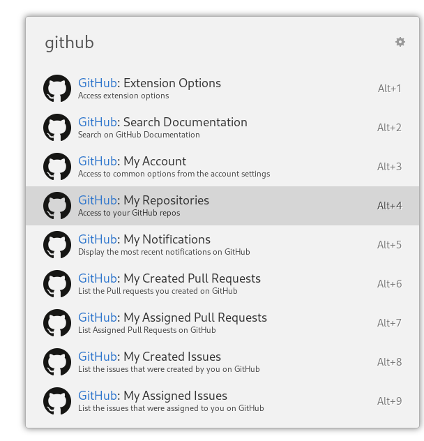

# Ulauncher Github

> [ulauncher](https://ulauncher.io/) Extension that provides quick access to common [GitHub](https://github.com) functionality like your repositorie, assigned issues or Pull Requests and many more.
[](https://github.com/brpaz/ulauncher-docker/workflows)
[](https://ext.ulauncher.io/-/github-brpaz-ulauncher-github)


## Usage


## Features

- Quick access to your repositories and organizations.
- Access to your Issues and Pull Requests (Assigned, Created)
- Search public repos and users
- Search on [GitHub Documentation pages](https://docs.github.com/en)

## Requirements

- [ulauncher 5](https://ulauncher.io/)
- Python > 3

## Install

Open ulauncher preferences window -> extensions -> add extension and paste the following url:

`https://github.com/brpaz/ulauncher-github`

**This extension requires [PyGitHub](https://pygithub.readthedocs.io/en/latest/introduction.html) and [requests](https://pypi.org/project/requests/) for it to work.**

You can install all the required dependencies by after installing the extension run the following command:

```bash
cd ~/.local/share/ulauncher/extensions/com.github.com.brpaz.ulauncher-github
pip install -r requirements.txt
```

## Usage

Before being able to start using the extension, you must generate a **Personal Access Token** (PAT) and configure it in the extension settings. The access token will allow the extension to access the GitHub API.

You can generate yours [here](https://github.com/settings/tokens). Make sure you select at least the permissions for "repo", "read:org", "gist", "user" and "notifications", otherwise you might see errors when using some specific commands in the extension.

This extension provides various commands/keywords to access the different functionality. If you type `GitHub` in Ulauncher you should see the available commands.



These include:

- GitHub: Search Repositories
- GitHub: Search Users
- GitHub: My Gists
- GitHub: My Organizations
- GitHub: My Assigned Issues
- GitHub: My Created Issues
- GitHub: My Assigned Pull Requests
- GitHub: My Created Pull Requests
- GitHub: My Notifications
- GitHub: My Repositories
- GitHub: My Account
- GitHub: Search Documentation
- GitHub: Extension Options

### Note on Cache

When the extension starts, it will download a list of all of your repositories, stars and gists and save them in a `json` file. This helps for performance reasons and GitHub API doesn´t have a way to search on your own and organizations repostories in the same request.

This information is cached for 1 day by default. You can clear your cache and trigger a reindex of the local data by restarting ulauncher or by going to `GitHub: Extension Options -> Refresh cache`.

Depending on the number of repositories you have access, this indexing process might take some time. It is executed in the background and you will receive a notification when the process finishes.

## Development

```
git clone https://github.com/brpaz/ulauncher-github
make link
```

The ```make link``` will create a symbolic link to the ulauncher extensions folder.

Next, stop Ulauncher if running and run the following command:

```
make dev
```

This will start Ulauncher from the command line with all extensions disabled. In the output you will see something like this:

```
 VERBOSE=1 ULAUNCHER_WS_API=ws://127.0.0.1:5054/com.github.brpaz.ulauncher-github PYTHONPATH=/usr/lib/python3.8/site-packages /usr/bin/python3 /home/bruno/.local/share/ulauncher/extensions/com.github.brpaz.ulauncher-github/main.py
```

Run this, command in another terminal window, to laucnh the GitHub Extension.


## TODO

- Cache user repositories, gists and organizations in background for faster results.

## Contributing

Contributions are what make the open source community such an amazing place to be learn, inspire, and create. Any contributions you make are **greatly appreciated**.

1. Fork the Project
2. Create your Feature Branch (`git checkout -b feature/AmazingFeature`)
3. Commit your Changes (`git commit -m 'Add some AmazingFeature'`)
4. Push to the Branch (`git push origin feature/AmazingFeature`)
5. Open a Pull Request
## 💛 Support the project

If this project was useful to you in some form, I would be glad to have your support.  It will help to keep the project alive and to have more time to work on Open Source.

The sinplest form of support is to give a ⭐️ to this repo.

You can also contribute with [GitHub Sponsors](https://github.com/sponsors/brpaz).

[](https://github.com/sponsors/brpaz)


Or if you prefer a one time donation to the project, you can simple:

<a href="https://www.buymeacoffee.com/Z1Bu6asGV" target="_blank"></a>
## 📝 License

Copyright © 2020 [Bruno Paz](https://github.com/brpaz).

This project is [MIT](https://opensource.org/licenses/MIT) licensed.
